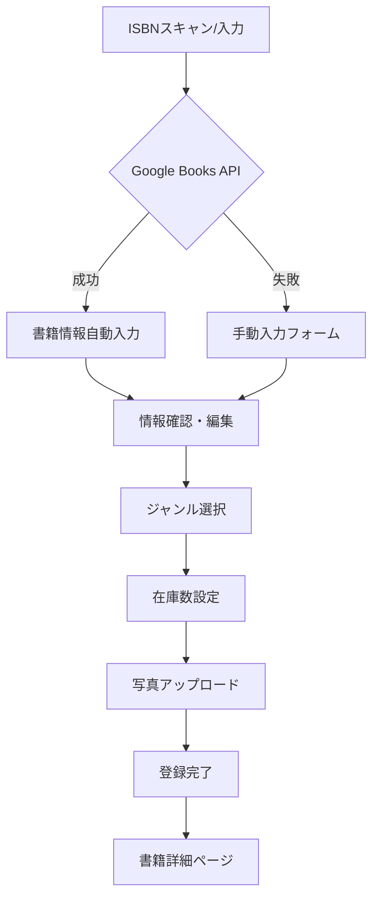
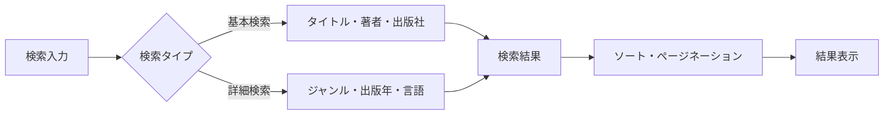

# 拡張書籍登録システム - 技術設計書

## 概要

既存のLaravel図書館管理システムを基盤として、ISBNスキャン機能を活用した包括的な書籍登録システムを実装します。Google Books API連携、写真アップロード、ジャンル分類、在庫管理機能を統合した効率的な書籍管理システムを構築します。

## アーキテクチャ

### 技術スタック
- **バックエンド**: Laravel 11.x (PHP 8.2+)
- **データベース**: MySQL 8.0
- **フロントエンド**: Blade テンプレート + Tailwind CSS + Alpine.js
- **認証**: Laravel Breeze（既存）
- **外部API**: Google Books API v1
- **ファイルストレージ**: Laravel Storage（ローカル/S3対応）
- **画像処理**: Intervention Image
- **開発環境**: Docker (Laravel Sail)

### システム構成
```
app/
├── Http/Controllers/
│   ├── BookController.php (拡張 - ジャンル管理含む)
│   └── BookImageController.php (新規)
├── Models/
│   ├── Book.php (拡張)
│   ├── Genre.php (新規)
│   ├── BookImage.php (新規)
│   └── User.php (既存)
├── Services/
│   ├── GoogleBooksService.php (新規)
│   └── ImageProcessingService.php (新規)
└── Middleware/
    └── AdminMiddleware.php (既存)

resources/views/
├── books/
│   ├── index.blade.php (拡張)
│   ├── create.blade.php (拡張)
│   ├── show.blade.php (拡張)
│   ├── isbn-scan.blade.php (拡張)
│   ├── edit.blade.php (新規)
│   └── manage-genres.blade.php (新規 - ジャンル管理統合)
└── components/
    ├── book-card.blade.php (新規)
    ├── image-gallery.blade.php (新規)
    └── genre-selector.blade.php (新規)
```

## コンポーネントとインターフェース

### 1. データベース設計

#### 既存テーブルの拡張

**booksテーブル（拡張）**
```sql
ALTER TABLE books ADD COLUMN (
    publisher VARCHAR(255) NULL AFTER author,
    published_date DATE NULL AFTER publisher,
    description TEXT NULL AFTER published_date,
    page_count INT NULL AFTER description,
    language VARCHAR(10) DEFAULT 'ja' AFTER page_count,
    google_books_id VARCHAR(255) NULL AFTER language,
    thumbnail_url TEXT NULL AFTER google_books_id,
    stock_count INT DEFAULT 1 AFTER thumbnail_url,
    available_count INT DEFAULT 1 AFTER stock_count,
    genre_id BIGINT UNSIGNED NULL AFTER available_count,
    created_by BIGINT UNSIGNED NULL AFTER genre_id,
    updated_by BIGINT UNSIGNED NULL AFTER created_by,
    
    INDEX idx_genre_id (genre_id),
    INDEX idx_publisher (publisher),
    INDEX idx_published_date (published_date),
    INDEX idx_language (language),
    INDEX idx_stock_status (available_count, stock_count),
    
    FOREIGN KEY (genre_id) REFERENCES genres(id) ON DELETE SET NULL,
    FOREIGN KEY (created_by) REFERENCES users(id) ON DELETE SET NULL,
    FOREIGN KEY (updated_by) REFERENCES users(id) ON DELETE SET NULL
);
```

#### 新規テーブル

**genresテーブル**
```sql
CREATE TABLE genres (
    id BIGINT UNSIGNED PRIMARY KEY AUTO_INCREMENT,
    name VARCHAR(100) NOT NULL UNIQUE,
    description TEXT NULL,
    color VARCHAR(7) DEFAULT '#6B7280' COMMENT 'HEXカラーコード',
    sort_order INT DEFAULT 0,
    is_active BOOLEAN DEFAULT TRUE,
    created_at TIMESTAMP NULL,
    updated_at TIMESTAMP NULL,
    
    INDEX idx_name (name),
    INDEX idx_sort_order (sort_order),
    INDEX idx_active (is_active)
);
```

**book_imagesテーブル**
```sql
CREATE TABLE book_images (
    id BIGINT UNSIGNED PRIMARY KEY AUTO_INCREMENT,
    book_id BIGINT UNSIGNED NOT NULL,
    image_path VARCHAR(500) NOT NULL,
    image_type ENUM('cover', 'additional') DEFAULT 'additional',
    alt_text VARCHAR(255) NULL,
    sort_order INT DEFAULT 0,
    file_size INT NULL COMMENT 'バイト単位',
    mime_type VARCHAR(100) NULL,
    created_at TIMESTAMP NULL,
    updated_at TIMESTAMP NULL,
    
    FOREIGN KEY (book_id) REFERENCES books(id) ON DELETE CASCADE,
    INDEX idx_book_id (book_id),
    INDEX idx_type_order (image_type, sort_order)
);
```

### 2. サービス層設計

#### GoogleBooksService
```php
class GoogleBooksService
{
    private const API_BASE_URL = 'https://www.googleapis.com/books/v1/volumes';
    
    public function fetchByIsbn(string $isbn): ?array
    public function fetchByTitle(string $title): array
    public function parseVolumeInfo(array $volumeInfo): array
    private function buildSearchQuery(array $params): string
    private function handleApiResponse($response): array
}
```

#### ImageProcessingService
```php
class ImageProcessingService
{
    public function processUploadedImage(UploadedFile $file, string $bookId): string
    public function createThumbnail(string $imagePath, int $width = 300): string
    public function optimizeImage(string $imagePath): void
    public function deleteImage(string $imagePath): bool
    private function generateUniqueFilename(string $originalName): string
}
```

### 3. コントローラー設計

#### BookController（拡張）
```php
class BookController extends Controller
{
    public function __construct(
        private GoogleBooksService $googleBooksService,
        private ImageProcessingService $imageService
    ) {}
    
    // 既存メソッドの拡張
    public function index(Request $request) // 検索・フィルタリング機能拡張
    public function create() // ISBNスキャン統合
    public function store(Request $request) // 拡張データ対応
    public function show(Book $book) // 詳細表示拡張
    public function edit(Book $book) // 新規
    public function update(Request $request, Book $book) // 新規
    
    // 新規メソッド
    public function fetchFromIsbn(Request $request): JsonResponse
    public function updateStock(Request $request, Book $book): JsonResponse
    
    // ジャンル管理メソッド（統合）
    public function manageGenres(): View
    public function storeGenre(Request $request): RedirectResponse
    public function updateGenre(Request $request, Genre $genre): RedirectResponse
    public function destroyGenre(Genre $genre): RedirectResponse
    public function reorderGenres(Request $request): JsonResponse
}
```

### 4. モデル設計

#### Book モデル（拡張）
```php
class Book extends Model
{
    protected $fillable = [
        'title', 'author', 'isbn', 'publisher', 'published_date',
        'description', 'page_count', 'language', 'google_books_id',
        'thumbnail_url', 'stock_count', 'available_count', 'genre_id'
    ];
    
    protected $casts = [
        'published_date' => 'date',
        'page_count' => 'integer',
        'stock_count' => 'integer',
        'available_count' => 'integer',
    ];
    
    // リレーション
    public function genre(): BelongsTo
    public function images(): HasMany
    public function loans(): HasMany // 既存
    public function currentLoan(): HasOne // 既存
    public function createdBy(): BelongsTo
    public function updatedBy(): BelongsTo
    
    // スコープ
    public function scopeSearch($query, string $keyword)
    public function scopeByGenre($query, int $genreId)
    public function scopeAvailable($query)
    public function scopePublishedBetween($query, $startDate, $endDate)
    
    // アクセサ・ミューテータ
    public function getMainImageAttribute(): ?string
    public function getFormattedPublishedDateAttribute(): string
    public function getAvailabilityStatusAttribute(): string
    
    // ビジネスロジック
    public function isAvailable(): bool // 既存
    public function canBorrow(): bool
    public function incrementStock(int $count = 1): void
    public function decrementStock(int $count = 1): void
    public function updateAvailableCount(): void
}
```

#### Genre モデル（新規）
```php
class Genre extends Model
{
    protected $fillable = ['name', 'description', 'color', 'sort_order', 'is_active'];
    
    protected $casts = [
        'is_active' => 'boolean',
        'sort_order' => 'integer',
    ];
    
    public function books(): HasMany
    public function scopeActive($query)
    public function scopeOrdered($query)
    
    public function getBooksCountAttribute(): int
}
```

#### BookImage モデル（新規）
```php
class BookImage extends Model
{
    protected $fillable = ['book_id', 'image_path', 'image_type', 'alt_text', 'sort_order'];
    
    protected $casts = [
        'sort_order' => 'integer',
    ];
    
    public function book(): BelongsTo
    
    public function getFullUrlAttribute(): string
    public function getThumbnailUrlAttribute(): string
    
    protected static function booted()
    {
        static::deleting(function ($image) {
            // ファイル削除処理
        });
    }
}
```

## データモデル

### 書籍登録フロー


### 検索・フィルタリング機能


## エラーハンドリング

### API エラー処理
- **Google Books API**: タイムアウト、レート制限、無効なレスポンス
- **画像アップロード**: ファイルサイズ制限、形式制限、ストレージエラー
- **データベース**: 制約違反、接続エラー、トランザクション失敗

### バリデーション
```php
// 書籍登録バリデーション
$rules = [
    'title' => 'required|max:255',
    'author' => 'required|max:255',
    'isbn' => 'required|unique:books,isbn,' . $book->id . '|regex:/^[0-9\-X]+$/',
    'publisher' => 'nullable|max:255',
    'published_date' => 'nullable|date|before_or_equal:today',
    'description' => 'nullable|max:2000',
    'page_count' => 'nullable|integer|min:1|max:9999',
    'language' => 'nullable|in:ja,en,fr,de,es,zh,ko',
    'stock_count' => 'required|integer|min:1|max:999',
    'genre_id' => 'nullable|exists:genres,id',
    'images.*' => 'image|mimes:jpeg,png,jpg,gif|max:5120', // 5MB
];
```

## テスト戦略

### 単体テスト
- **GoogleBooksService**: API レスポンス処理、エラーハンドリング
- **ImageProcessingService**: 画像処理、ファイル操作
- **Book モデル**: ビジネスロジック、スコープ、リレーション
- **Genre モデル**: バリデーション、スコープ

### 機能テスト
- **書籍登録フロー**: ISBNスキャン → 情報取得 → 登録完了
- **検索機能**: 基本検索、詳細検索、フィルタリング
- **画像アップロード**: 複数画像、リサイズ、削除
- **在庫管理**: 在庫増減、利用可能数更新

### ブラウザテスト
- **レスポンシブデザイン**: モバイル、タブレット、デスクトップ
- **JavaScript機能**: ISBNスキャン、画像プレビュー、非同期処理
- **ユーザビリティ**: 登録フロー、検索体験

## セキュリティ考慮事項

### 認証・認可
- **管理者権限**: 書籍登録、編集、削除、ジャンル管理
- **一般ユーザー**: 検索、閲覧のみ
- **CSRF保護**: 全フォーム送信

### ファイルアップロード
- **ファイル形式制限**: 画像ファイルのみ許可
- **ファイルサイズ制限**: 最大5MB
- **ファイル名サニタイゼーション**: 安全なファイル名生成
- **ストレージ分離**: アップロードファイルの適切な配置

### データ保護
- **入力値検証**: 全入力データのバリデーション
- **SQLインジェクション対策**: Eloquent ORM使用
- **XSS対策**: Blade テンプレートエスケープ

## パフォーマンス考慮事項

### データベース最適化
- **インデックス**: 検索頻度の高いカラムにインデックス設定
- **クエリ最適化**: N+1問題の回避、適切なEager Loading
- **ページネーション**: 大量データの効率的な表示

### 画像処理最適化
- **非同期処理**: 画像リサイズ・最適化をキューで処理
- **CDN対応**: 画像配信の高速化
- **レスポンシブ画像**: 複数サイズの画像生成

### キャッシュ戦略
- **検索結果キャッシュ**: 人気検索キーワードの結果キャッシュ
- **ジャンル情報キャッシュ**: 頻繁にアクセスされるジャンル情報
- **画像キャッシュ**: ブラウザキャッシュの適切な設定

## 開発フェーズ

### フェーズ1: データベース拡張
1. マイグレーション作成・実行
2. モデル関係の定義
3. シーダーでサンプルデータ作成

### フェーズ2: Google Books API統合
1. GoogleBooksService実装
2. ISBN検索機能の拡張
3. エラーハンドリング実装

### フェーズ3: 画像アップロード機能
1. ImageProcessingService実装
2. 複数画像アップロード機能
3. 画像表示・削除機能

### フェーズ4: ジャンル管理機能
1. Genre モデル実装
2. BookController にジャンル管理メソッド追加
3. ジャンル管理画面作成（books/manage-genres.blade.php）
4. 書籍登録・検索でのジャンル連携

### フェーズ5: UI/UX改善
1. レスポンシブデザイン調整
2. 検索・フィルタリング機能強化
3. パフォーマンス最適化