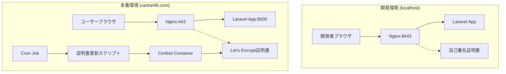

# HTTPS化実装 設計書

## 概要

本設計書は、vantanlib.comドメインでの本番環境HTTPS化実装について詳細な設計を定義します。複数存在するDocker設定ファイルの統合、Let's Encryptを使用した自動証明書管理、および完全自動化された運用システムの構築を設計します。

## アーキテクチャ

### システム全体構成



### 環境別アーキテクチャ比較

| 要素 | 開発環境 | 本番環境 |
|------|----------|----------|
| ドメイン | localhost | vantanlib.com |
| HTTPSポート | 8443 | 443 |
| SSL証明書 | 自己署名証明書 | Let's Encrypt |
| 証明書管理 | 手動生成 | Certbot自動取得 |
| 更新頻度 | 年1回 | 90日ごと自動 |

## コンポーネントと インターフェース

### 1. Nginxコンポーネント

#### 開発環境設定
```nginx
# docker/nginx/default.dev.conf
server {
    listen 8443 ssl;
    server_name localhost;
    
    ssl_certificate /etc/nginx/ssl/localhost.crt;
    ssl_certificate_key /etc/nginx/ssl/localhost.key;
    
    # セキュリティ設定
    ssl_protocols TLSv1.2 TLSv1.3;
    ssl_ciphers HIGH:!aNULL:!MD5;
    
    location / {
        try_files $uri $uri/ /index.php?$query_string;
    }
}
```

#### 本番環境設定（vantanlib.com用）
```nginx
# docker/nginx/default.prod.conf
server {
    listen 80;
    server_name vantanlib.com www.vantanlib.com;
    
    # Let's Encrypt認証用
    location /.well-known/acme-challenge/ {
        root /var/www/certbot;
    }
    
    # HTTPSリダイレクト
    location / {
        return 301 https://vantanlib.com$request_uri;
    }
}

server {
    listen 443 ssl http2;
    server_name vantanlib.com www.vantanlib.com;
    
    # www -> non-www リダイレクト
    if ($host = www.vantanlib.com) {
        return 301 https://vantanlib.com$request_uri;
    }
    
    ssl_certificate /etc/letsencrypt/live/vantanlib.com/fullchain.pem;
    ssl_certificate_key /etc/letsencrypt/live/vantanlib.com/privkey.pem;
    
    # 強化されたセキュリティ設定
    ssl_protocols TLSv1.2 TLSv1.3;
    ssl_ciphers ECDHE-RSA-AES256-GCM-SHA512:DHE-RSA-AES256-GCM-SHA512:ECDHE-RSA-AES256-GCM-SHA384;
    ssl_prefer_server_ciphers off;
    
    # SSL最適化
    ssl_session_cache shared:SSL:10m;
    ssl_session_timeout 10m;
    ssl_session_tickets off;
    
    # OCSP Stapling
    ssl_stapling on;
    ssl_stapling_verify on;
    
    # セキュリティヘッダー
    add_header Strict-Transport-Security "max-age=31536000; includeSubDomains; preload" always;
    add_header X-Frame-Options DENY always;
    add_header X-Content-Type-Options nosniff always;
    add_header X-XSS-Protection "1; mode=block" always;
    add_header Referrer-Policy "strict-origin-when-cross-origin" always;
    
    # CSP設定（カメラ機能対応）
    add_header Content-Security-Policy "default-src 'self'; script-src 'self' 'unsafe-inline' 'unsafe-eval'; style-src 'self' 'unsafe-inline'; img-src 'self' data: https:; media-src 'self' blob:; connect-src 'self' https://www.googleapis.com; camera 'self';" always;
    
    location / {
        proxy_pass http://app:8000;
        proxy_set_header Host $host;
        proxy_set_header X-Real-IP $remote_addr;
        proxy_set_header X-Forwarded-For $proxy_add_x_forwarded_for;
        proxy_set_header X-Forwarded-Proto $scheme;
        proxy_set_header X-Forwarded-Port $server_port;
    }
    
    # 静的ファイルの最適化
    location ~* \.(css|js|png|jpg|jpeg|gif|ico|svg|woff|woff2|ttf|eot)$ {
        expires 1y;
        add_header Cache-Control "public, immutable";
        add_header Vary Accept-Encoding;
    }
}
```

### 2. Certbotコンポーネント

#### vantanlib.com用証明書取得プロセス
```yaml
# docker-compose.prod.yml
services:
  app:
    build:
      context: ./
      dockerfile: Dockerfile
    container_name: library-prod-app
    restart: unless-stopped
    environment:
      - APP_ENV=production
      - APP_DEBUG=false
      - APP_URL=https://vantanlib.com
    volumes:
      - .:/workdir
    networks:
      - library-prod-network

  nginx:
    image: nginx:alpine
    container_name: library-prod-nginx
    restart: unless-stopped
    ports:
      - "80:80"
      - "443:443"
    volumes:
      - ./docker/nginx/default.prod.conf:/etc/nginx/conf.d/default.conf
      - ./docker/certbot/conf:/etc/letsencrypt
      - ./docker/certbot/www:/var/www/certbot
      - .:/workdir
    depends_on:
      - app
    networks:
      - library-prod-network

  certbot:
    image: certbot/certbot
    container_name: library-prod-certbot
    volumes:
      - ./docker/certbot/conf:/etc/letsencrypt
      - ./docker/certbot/www:/var/www/certbot
    command: |
      certonly --webroot 
      -w /var/www/certbot 
      --email admin@vantanlib.com 
      -d vantanlib.com 
      -d www.vantanlib.com
      --agree-tos 
      --no-eff-email
      --non-interactive

networks:
  library-prod-network:
    driver: bridge

volumes:
  certbot_conf:
  certbot_www:
```

#### vantanlib.com用自動更新メカニズム
```bash
#!/bin/bash
# scripts/renew-ssl.sh
LOG_FILE="/var/log/ssl-renewal.log"
EMAIL="admin@vantanlib.com"

echo "$(date): 🔄 vantanlib.com SSL証明書の更新を確認しています..." | tee -a $LOG_FILE

# 証明書更新チェック（dry-runで事前確認）
docker compose -f docker-compose.prod.yml exec certbot certbot renew --dry-run --quiet

if [ $? -eq 0 ]; then
    # 実際の更新実行
    docker compose -f docker-compose.prod.yml exec certbot certbot renew --quiet
    
    if [ $? -eq 0 ]; then
        # Nginx設定リロード
        docker compose -f docker-compose.prod.yml exec nginx nginx -s reload
        echo "$(date): ✅ vantanlib.com SSL証明書の更新が完了しました" | tee -a $LOG_FILE
        
        # 成功通知
        echo "vantanlib.com SSL証明書が正常に更新されました。" | mail -s "SSL証明書更新成功" $EMAIL
    else
        echo "$(date): ❌ vantanlib.com SSL証明書の更新に失敗しました" | tee -a $LOG_FILE
        # 失敗通知
        echo "vantanlib.com SSL証明書の更新に失敗しました。ログを確認してください。" | mail -s "SSL証明書更新失敗" $EMAIL
    fi
else
    echo "$(date): ⚠️ vantanlib.com SSL証明書の更新前チェックに失敗しました" | tee -a $LOG_FILE
fi

# 証明書の有効期限確認
CERT_EXPIRY=$(openssl x509 -enddate -noout -in /etc/letsencrypt/live/vantanlib.com/fullchain.pem | cut -d= -f2)
echo "$(date): 📅 現在の証明書有効期限: $CERT_EXPIRY" | tee -a $LOG_FILE
```

### 3. Laravel設定コンポーネント

#### vantanlib.com用環境変数設定
```env
# .env.production
APP_NAME="Library Management System"
APP_ENV=production
APP_KEY=base64:your-production-key-here
APP_DEBUG=false
APP_URL=https://vantanlib.com

# データベース設定（本番環境用）
DB_CONNECTION=mysql
DB_HOST=prod-db-server
DB_PORT=3306
DB_DATABASE=library_production
DB_USERNAME=library_user
DB_PASSWORD=secure_production_password

# セキュリティ設定
SESSION_SECURE_COOKIE=true
SESSION_SAME_SITE=strict
SESSION_DOMAIN=vantanlib.com
SANCTUM_STATEFUL_DOMAINS=vantanlib.com

# キャッシュ設定（本番環境用）
CACHE_DRIVER=redis
SESSION_DRIVER=redis
QUEUE_CONNECTION=redis

# メール設定
MAIL_MAILER=smtp
MAIL_HOST=smtp.vantanlib.com
MAIL_PORT=587
MAIL_USERNAME=noreply@vantanlib.com
MAIL_PASSWORD=secure_mail_password
MAIL_ENCRYPTION=tls
MAIL_FROM_ADDRESS=noreply@vantanlib.com
MAIL_FROM_NAME="Library Management System"

# Google Books API
GOOGLE_BOOKS_API_KEY=your-google-books-api-key

# ログ設定
LOG_CHANNEL=daily
LOG_LEVEL=warning
```

#### HTTPS強制ミドルウェア
```php
// app/Http/Middleware/ForceHttps.php
<?php

namespace App\Http\Middleware;

use Closure;
use Illuminate\Http\Request;

class ForceHttps
{
    public function handle(Request $request, Closure $next)
    {
        if (!$request->secure() && app()->environment('production')) {
            return redirect()->secure($request->getRequestUri());
        }

        return $next($request);
    }
}
```

## データモデル

### SSL証明書管理データ

```php
// 証明書情報の管理（ログ用）
class SslCertificate
{
    public string $domain;
    public DateTime $issued_at;
    public DateTime $expires_at;
    public string $issuer; // "Let's Encrypt" or "Self-signed"
    public string $status; // "active", "expired", "renewing"
}
```

### 設定管理データ

```php
// 環境別設定管理
class HttpsConfig
{
    public string $environment; // "development", "production"
    public string $domain;
    public int $port;
    public string $certificate_path;
    public string $private_key_path;
    public array $ssl_protocols;
    public array $security_headers;
}
```

## エラーハンドリング

### 証明書関連エラー

1. **証明書取得失敗**
   ```bash
   # エラーパターン
   - ドメインのDNS設定が不正
   - ポート80/443がブロックされている
   - Let's Encryptのレート制限に達している
   
   # 対処法
   - DNS設定の確認
   - ファイアウォール設定の確認
   - ステージング環境での事前テスト
   ```

2. **証明書更新失敗**
   ```bash
   # 監視とアラート
   - Cronジョブの実行ログ監視
   - 証明書有効期限の事前チェック
   - 失敗時の管理者通知
   ```

3. **Mixed Content エラー**
   ```javascript
   // 対処法：すべてのリソースをHTTPS化
   // ❌ 問題のあるコード
   fetch('http://api.example.com/data')
   
   // ✅ 修正後のコード
   fetch('https://api.example.com/data')
   ```

### エラー監視とログ

```nginx
# Nginxエラーログ設定
error_log /var/log/nginx/error.log warn;
access_log /var/log/nginx/access.log combined;

# SSL関連のログレベル
ssl_session_cache shared:SSL:10m;
ssl_session_timeout 10m;
```

## テスト戦略

### 1. 開発環境テスト

```bash
# HTTPS接続テスト
curl -k https://localhost:8443/

# カメラ機能テスト（ブラウザ）
navigator.mediaDevices.getUserMedia({video: true})
  .then(stream => console.log('カメラアクセス成功'))
  .catch(err => console.error('カメラアクセス失敗:', err));

# Google Books API テスト
fetch('https://www.googleapis.com/books/v1/volumes?q=test')
  .then(response => response.json())
  .then(data => console.log('API呼び出し成功:', data));
```

### 2. 本番環境テスト

```bash
# SSL証明書検証
openssl s_client -connect your-domain.com:443 -servername your-domain.com

# セキュリティヘッダー確認
curl -I https://your-domain.com/

# 自動リダイレクトテスト
curl -I http://your-domain.com/
```

### 3. 自動テストスイート

```php
// tests/Feature/HttpsTest.php
class HttpsTest extends TestCase
{
    public function test_https_redirect()
    {
        if (app()->environment('production')) {
            $response = $this->get('http://your-domain.com/');
            $response->assertRedirect('https://your-domain.com/');
        }
    }
    
    public function test_secure_headers()
    {
        $response = $this->get('/');
        $response->assertHeader('Strict-Transport-Security');
        $response->assertHeader('X-Frame-Options', 'DENY');
    }
}
```

## セキュリティ考慮事項

### 1. SSL/TLS設定

- **プロトコル**: TLS 1.2以上のみ許可
- **暗号化スイート**: 強力な暗号化アルゴリズムを使用
- **Perfect Forward Secrecy**: ECDHE暗号化スイートを優先

### 2. セキュリティヘッダー

```nginx
# 必須セキュリティヘッダー
add_header Strict-Transport-Security "max-age=31536000; includeSubDomains" always;
add_header X-Frame-Options DENY;
add_header X-Content-Type-Options nosniff;
add_header X-XSS-Protection "1; mode=block";
add_header Referrer-Policy "strict-origin-when-cross-origin";
```

### 3. 証明書管理

- **自動更新**: 90日ごとの自動更新設定
- **バックアップ**: 証明書ファイルの定期バックアップ
- **監視**: 有効期限の事前監視とアラート

## パフォーマンス最適化

### 1. SSL最適化

```nginx
# SSL セッション最適化
ssl_session_cache shared:SSL:10m;
ssl_session_timeout 10m;
ssl_session_tickets off;

# OCSP Stapling
ssl_stapling on;
ssl_stapling_verify on;
```

### 2. HTTP/2対応

```nginx
# HTTP/2 有効化
listen 443 ssl http2;
```

### 3. 静的ファイル最適化

```nginx
# 静的ファイルの直接配信
location ~* \.(css|js|png|jpg|jpeg|gif|ico|svg)$ {
    expires 1y;
    add_header Cache-Control "public, immutable";
}
```