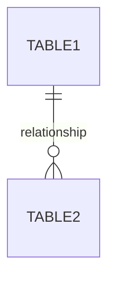

# DB設計・マイグレーション管理スキル

$ARGUMENTS に基づいてデータベース設計をサポートします。

## 実行手順

### Step 1: 要件分析
- 必要なエンティティを洗い出し
- リレーションシップを整理
- 将来の拡張性を考慮（ただし過度な設計は避ける）

### Step 2: スキーマ設計
以下を提示：
- テーブル定義（カラム、型、制約）
- インデックス設計
- 外部キー関係

### Step 3: ER図
Mermaid形式でER図を作成：


### Step 4: マイグレーション
- Laravelマイグレーションファイルとして作成
- 変更前後の差分を明示
- ロールバック手順を含める
- データ移行が必要な場合は手順を提示

## PostgreSQL（Neon）向け設計

このプロジェクトはNeon（PostgreSQL）を使用：
- PostgreSQL固有の型や機能を活用可能
- インデックス設計はクエリパターンに基づく
- 500MB無料枠を意識した効率的な設計

## 出力形式

```
## 設計概要
[変更の概要]

## テーブル構造
[テーブル定義]

## マイグレーション
[Laravelマイグレーションコード]

## 移行手順
1. [手順1]
2. [手順2]
```
